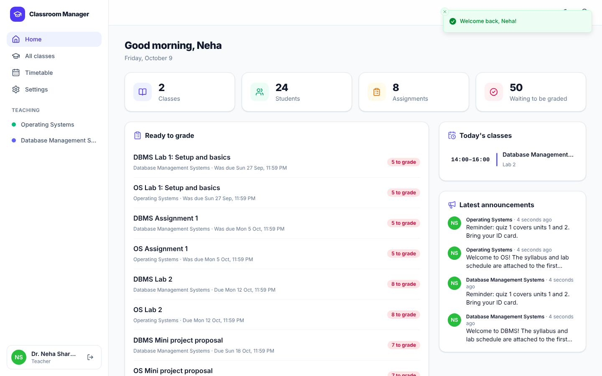
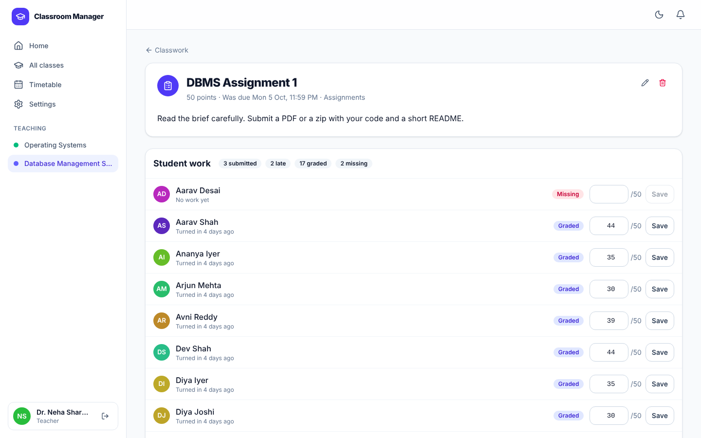
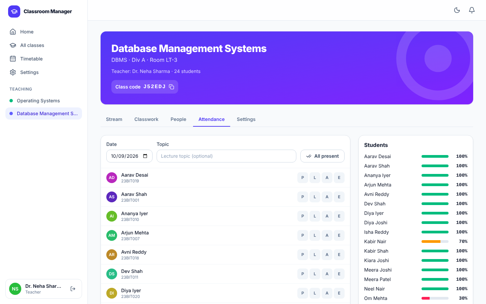
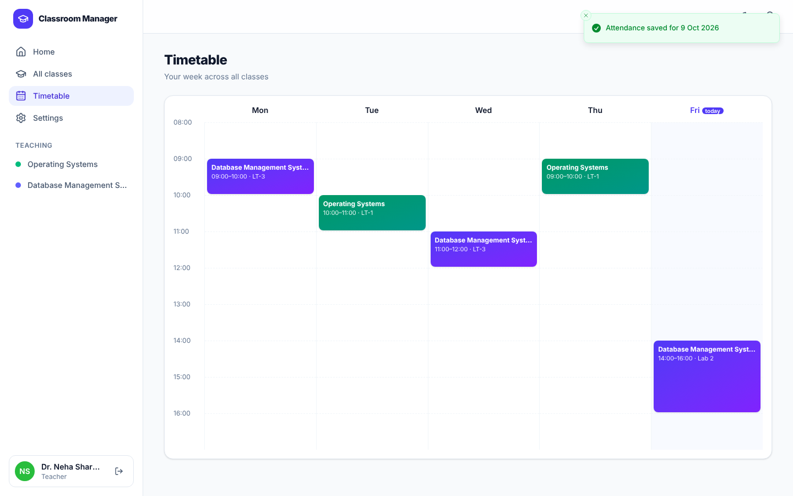
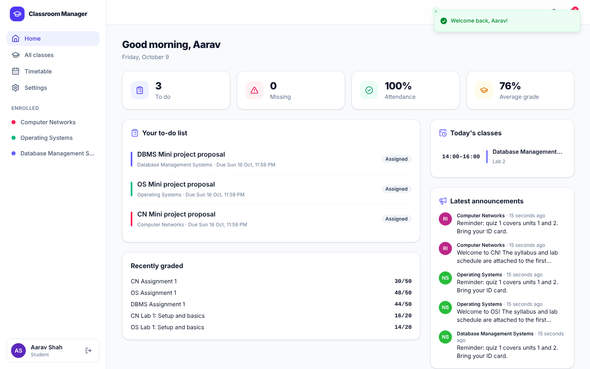
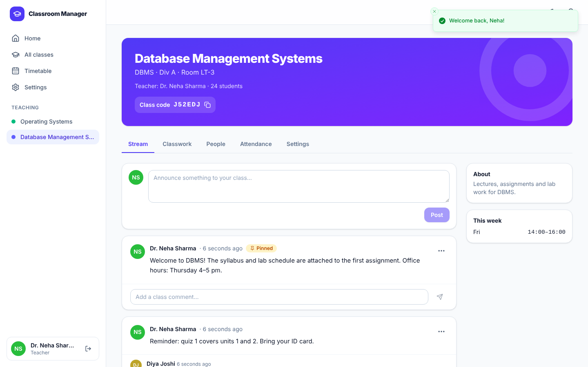
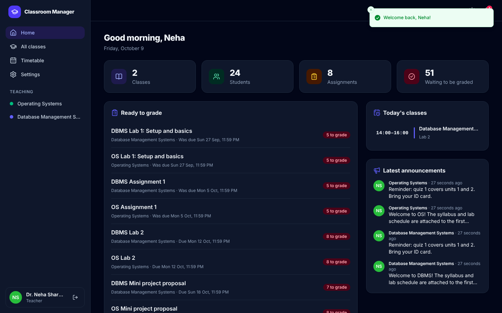
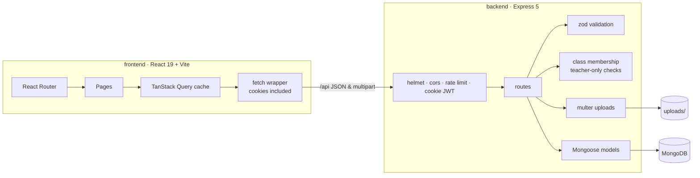
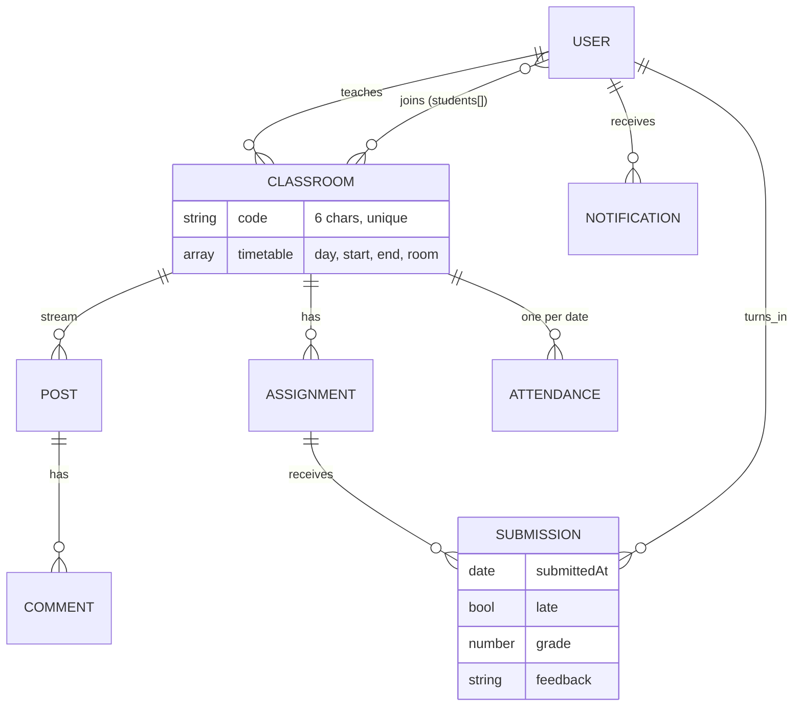

<div align="center">

# 🏫 Classroom Manager

**Everything a class needs in one calm place: announcements, assignments, grading, attendance and the weekly timetable.**

A full-stack MERN app with separate teacher and student experiences. Built as a team project at DA-IICT.

[](https://github.com/ChetanGadhiya017/Classroom-Management-daiict/actions/workflows/ci.yml)




</div>

---

## ✨ Features

| | Teacher | Student |
|---|---|---|
| 🏠 **Dashboard** | Classes, students, work waiting to be graded, today's lectures, latest posts | To-do list, missing work, attendance %, average grade, today's lectures |
| 🎓 **Classes** | Create with a colour theme, share a 6-character join code, rotate it, archive, delete | Join with the code, leave |
| 📣 **Stream** | Post announcements, pin, delete, moderate comments | Read and comment |
| 📝 **Assignments** | Instructions, attachments, points, due date, topic, *accept late work* toggle | See status: assigned, turned in, late, missing, graded |
| 📤 **Submissions** | See every student's status and work, grade with feedback | Turn in text and files, resubmit, unsubmit until graded |
| ✅ **Attendance** | Present / Late / Absent / Excused per date, *all present*, history, % per student | Personal percentage and history, warning below 75% |
| 🗓️ **Timetable** | Weekly slot editor per class | One weekly grid across all classes, today highlighted |
| 🔔 **Notifications** | Student joined, work turned in | New assignment, announcement, grade, reply |

**Also:** dark mode, responsive down to phone width, skeleton loaders, toasts, keyboard-accessible dialogs, and code splitting per page.

<table>
<tr>
<td width="50%"><p align="center"><sub>Grading: every student's status, work and grade</sub></p></td>
<td width="50%"><p align="center"><sub>Attendance with per-student percentages</sub></p></td>
</tr>
<tr>
<td width="50%"><p align="center"><sub>Weekly timetable across classes</sub></p></td>
<td width="50%"><p align="center"><sub>Student dashboard</sub></p></td>
</tr>
<tr>
<td width="50%"><p align="center"><sub>Class stream with comments</sub></p></td>
<td width="50%"><p align="center"><sub>Dark mode</sub></p></td>
</tr>
</table>

🎬 The original prototype walkthrough is in [`videoFile/`](videoFile).

---

## 🚀 Getting started

### Option 1: Docker (everything included)

```bash
git clone https://github.com/ChetanGadhiya017/Classroom-Management-daiict.git
cd Classroom-Management-daiict
docker compose up --build                       # → http://localhost:8000
docker compose exec app node src/seed.js        # optional demo data
```

### Option 2: Local development

Requires Node.js 20+ and MongoDB (local, Docker `docker run -p 27017:27017 mongo:7`, or Atlas).

```bash
npm run install:all
cp backend/.env.example backend/.env           # set MONGODB_URI and JWT_SECRET
npm run seed                                   # optional demo data (drops the database!)
npm run dev:api                                # API  → http://localhost:8000
npm run dev:web                                # Web  → http://localhost:5173 (proxies /api)
```

| Demo account | Password |
|---|---|
| `teacher@demo.local` | `teacher123` |
| `student@demo.local` | `student123` |

### Environment (`backend/.env`)

| Variable | Default | Meaning |
|---|---|---|
| `MONGODB_URI` | `mongodb://127.0.0.1:27017/classroom` | Database |
| `JWT_SECRET` | dev value | **Required in production** |
| `PORT` | `8000` | API port |
| `CLIENT_ORIGIN` | `http://localhost:5173` | Allowed CORS origin |
| `MAX_UPLOAD_MB` | `10` | Per-file upload limit |

---

## 🏗 Architecture





### API overview

| Area | Endpoints |
|---|---|
| Auth | `POST /api/auth/register` · `POST /login` · `POST /logout` · `GET /session` · `GET/PATCH /me` · `POST /me/password` |
| Classes | `GET/POST /api/classes` · `POST /classes/join` · `GET/PATCH/DELETE /classes/:id` · `POST /classes/:id/code` · `PUT /classes/:id/timetable` · `DELETE /classes/:id/students/:userId` |
| Stream | `GET/POST /classes/:id/posts` · `PATCH/DELETE /posts/:postId` · `POST /posts/:postId/comments` · `DELETE /comments/:commentId` |
| Assignments | `GET/POST /classes/:id/assignments` · `GET/PATCH/DELETE /assignments/:aid` · `PUT/DELETE /assignments/:aid/submission` · `POST/DELETE /assignments/:aid/grade/:studentId` |
| Attendance | `GET /classes/:id/attendance` · `PUT/DELETE /attendance/:YYYY-MM-DD` |
| Me | `GET /api/me/dashboard` · `GET /me/timetable` · `GET /me/notifications` · `POST /me/notifications/read` · `GET /me/files/:name` |

### Security

- Passwords hashed with bcrypt (12 rounds). JWT lives in an **httpOnly, SameSite=Lax** cookie, so JavaScript can't read it.
- Every class route checks membership; teacher-only actions are enforced on the server.
- Files are served only to class members, and a student can only download their own submissions.
- All input is validated with zod. Uploads are limited by type and size and stored under random names.
- Helmet headers, rate-limited auth endpoints, CORS restricted to the app's origin, generic 500 messages in production.

---

## 🧪 Tests

```bash
npm test          # 20 API integration tests (needs MongoDB; set MONGODB_URI_TEST to point elsewhere)
```

They cover registration and login, cookie sessions, roles, join codes, stream permissions, multipart assignments, the late policy, resubmission, file privacy, grading limits, dashboards, attendance upserts and percentages, and cascade deletes. CI runs them against `mongo:7`, lints and builds the web app, then boots the Docker stack and smoke-tests it.

---

## 🗂️ Structure

```
├── backend/
│   ├── src/
│   │   ├── app.js            Express app (security, routes, errors, serves frontend/dist)
│   │   ├── models/           User · Classroom · Post · Assignment/Submission · Attendance · Notification
│   │   ├── routes/           auth · classes · stream · assignments · attendance · me
│   │   ├── middleware/       auth (JWT + class access) · validate (zod) · upload (multer)
│   │   └── seed.js           demo data
│   └── tests/                vitest + supertest
├── frontend/
│   └── src/
│       ├── pages/            Dashboard · Classes · Timetable · Settings · class/* · Auth
│       ├── components/       Layout · UI primitives
│       └── lib/              api client · auth context · helpers
├── Dockerfile · docker-compose.yml
└── videoFile/                original prototype demo
```

## 🤝 Team

Built at DA-IICT. v2 (this rebuild) by [Chetan Gadhiya](https://github.com/ChetanGadhiya017), building on the original prototype by the team.
